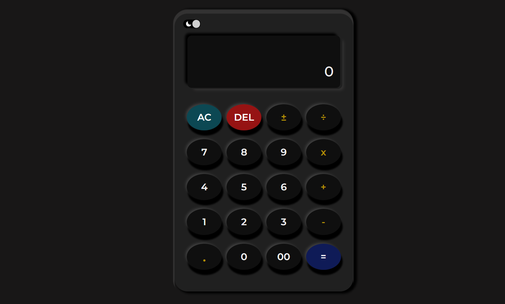

# Calculator App




Calculator App is a web application created using React and Styled Components. It provides a simple and user-friendly interface for performing basic arithmetic calculations.

## Features

- Perform addition, subtraction, multiplication, and division
- Clear the calculator display
- Display the result of the calculation

## Installation

To install and run the Calculator App locally, follow these steps:

1. Clone the repository:

   ```shell
   git clone https://github.com/your-username/calculator-app.git
   ```

2. Navigate to the project directory:

   ```shell
   cd calculator-app
   ```

3. Install the dependencies using npm:

   ```shell
   npm install
   ```

4. Start the development server:

   ```shell
   npm start
   ```

5. Open your web browser and navigate to [http://localhost:3000](http://localhost:3000) to access the Calculator App.

## Conclusion

The Calculator App is a React-based web application that allows individuals to perform simple arithmetic calculations. By following the installation instructions, you can set up the app locally and use it for performing basic calculations. Enjoy using the Calculator App for your arithmetic needs!
